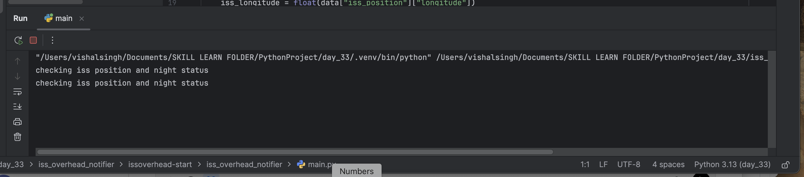

# ISS Overhead Notifier 

A Python app that notifies you via email when the International Space Station (ISS) is overhead 
at your location during night hours.
## Preview


## ✨ Features
- Tracks ISS current position using [Open Notify ISS API](http://open-notify.org/Open-Notify-API/ISS-Location-Now/)
- Checks local sunrise and sunset times using [Sunrise-Sunset API](https://sunrise-sunset.org/api)
- Sends email notification if ISS is overhead and it's night at your location
- Runs continuously with checks every 60 seconds

## 🔧 How It Works
1. The app fetches the current ISS position.
2. It checks whether your location is within ±5° latitude/longitude of the ISS.
3. It checks whether it is currently night at your location.
4. If both conditions are true, an email notification is sent to alert you to look up at the sky!

## 📦 Installation
1. Clone this repository:
   ```bash
   git clone https://github.com/vishalxai/iss_overhead_notifier.git
   cd iss_overhead_notifier
   ```

## ⚙️ Configuration

1. Open `config.py` and update your email and password:
   ```python
   MY_EMAIL = "your_email@gmail.com"
   MY_PASSWORD = "your_password"
   ```
2. Set your latitude and longitude coordinates in `main.py`:
   ```python
   MY_LAT = "your_latitude"
   MY_LONG = "your_longitude"
   ```

## 🚀 Running the App

Simply run:
```bash
python main.py
```

The app will check every 60 seconds and send an email when ISS is overhead at night.

## 📝 Notes
- Make sure to enable "less secure apps" or use an app password if using Gmail.
- You may also want to use an environment variable or `.env` file to securely store email credentials for production use.